.. raw:: html

    

.. role:: heading

:heading:`Master Data Management`

.. role:: bolditalic

Administrative List
--------------------

1. From the Sidebar of the control center, click the administrative list sub menu under the Master Data menu, add or modify an existing administration or delete an existing administration.

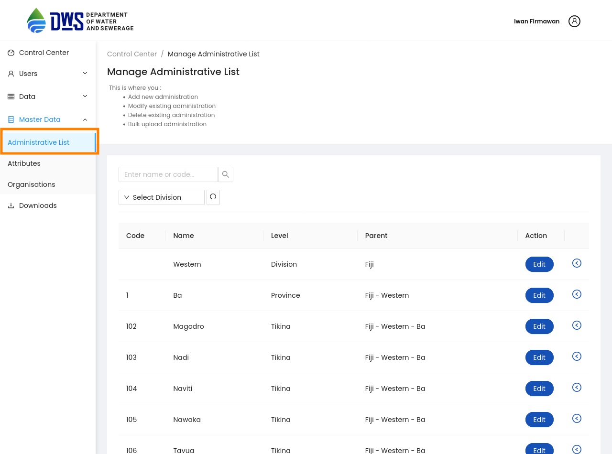

1. To edit an existing administration, click the Edit button next to the administration, Once data is updated click on the :bolditalic:`Save` Button

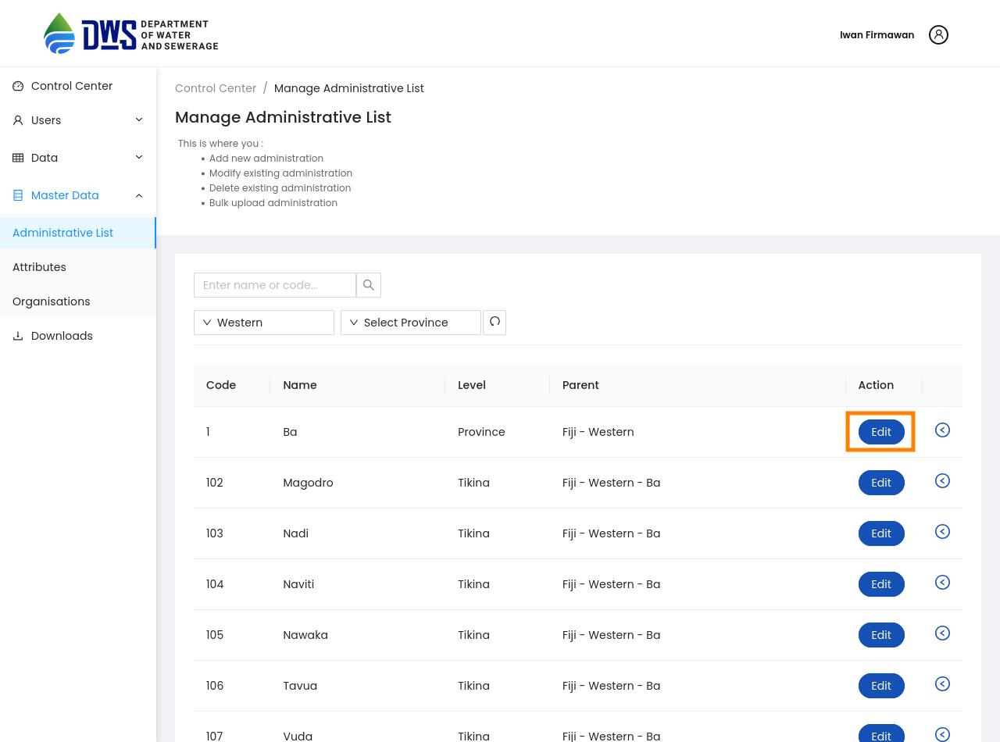

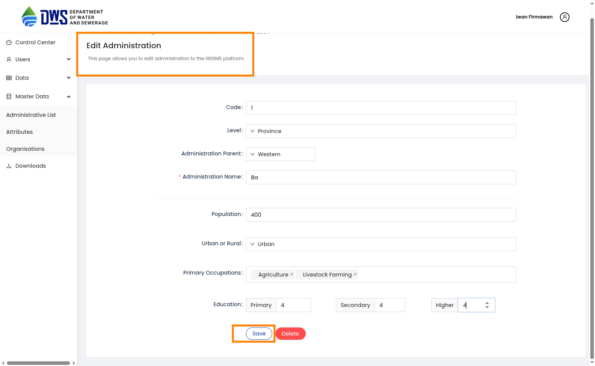

3.To delete click the Delete button. Next, confirm you are deleting the administration by clicking the OK button in the pop-up window.

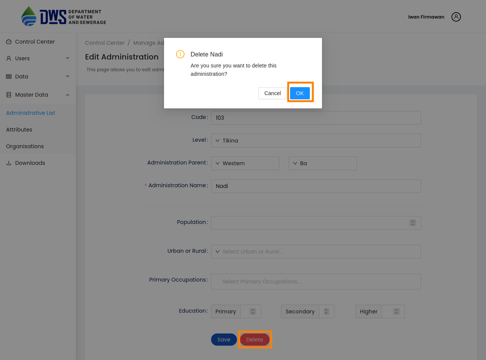

Manage Attributes
-------------------

1. From the Sidebar of the control center, click the attribute sub menu under the Master Data menu, add or modify an existing attribute or delete an existing attribute.

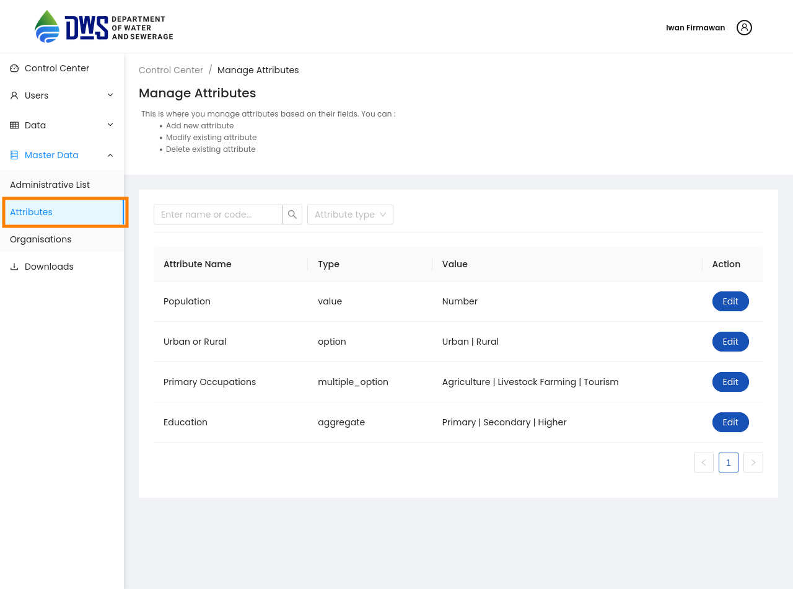

1. To delete or edit an existing attribute, click the Edit button next to the attribute, Once data is updated click on the :bolditalic:`Save` Button, For deleting the attribute Click :bolditalic:`Delete` Button. Next, click on the confirmation popup window for deleting attribute.

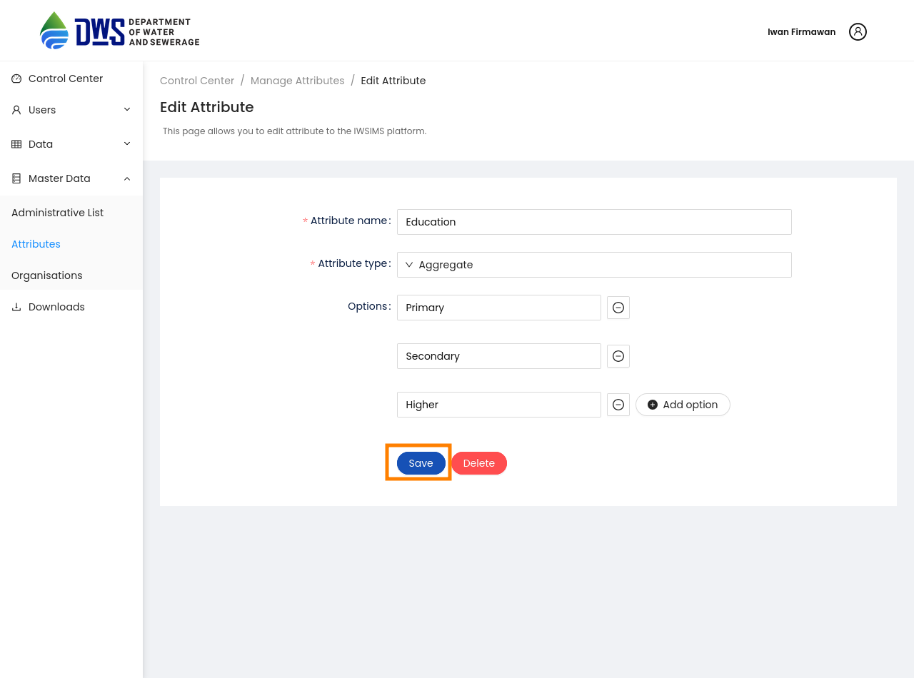

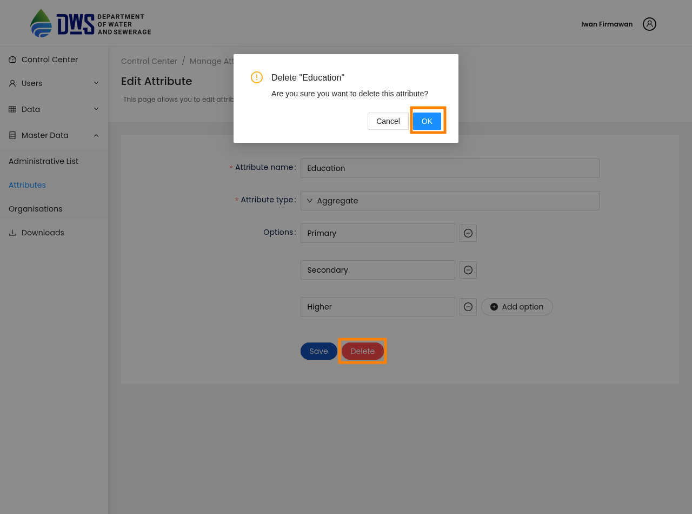

Manage Organizations
-----------------------
1. From the Sidebar of the control center, click the Organisations sub menu under the Master Data menu, add or modify an existing Organisation or delete an existing Organisation.

.. image:: ../assests/organisation-1.png
    :alt: Organisation list
    :width: 100%

2. To add a new Organisation, click the :bolditalic:`ADD NEW ORGANISATION` button. Next, fill all mandatory fileds. Finally, click the Save button to add the Organisation.

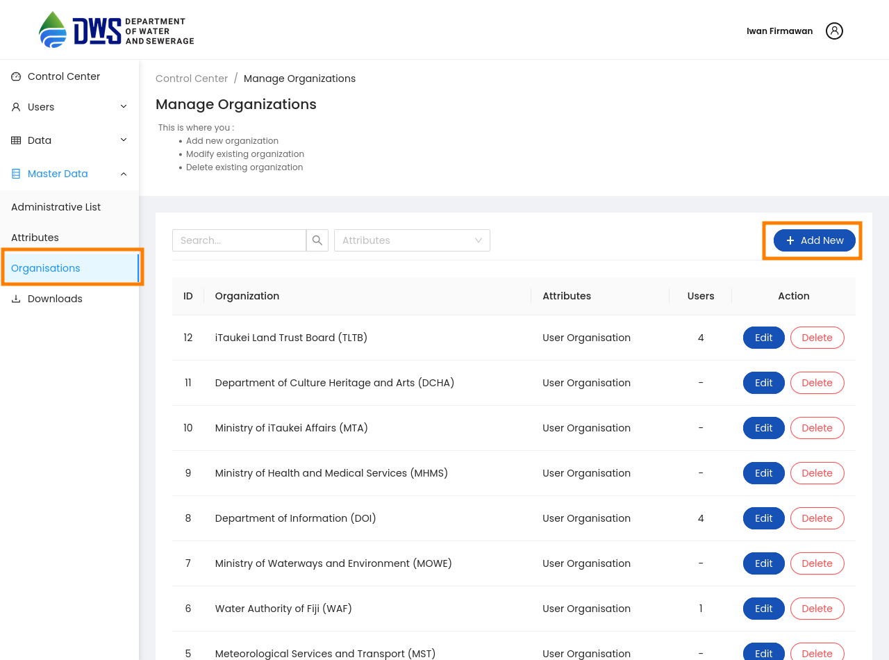

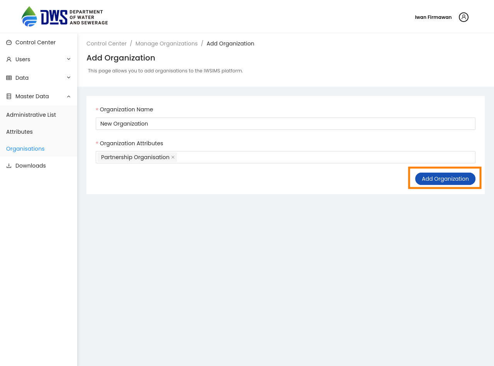

3. To edit an existing organisation, click the Edit button next to the organisation, Once data is updated click on the :bolditalic:`Update Organisation` Button.

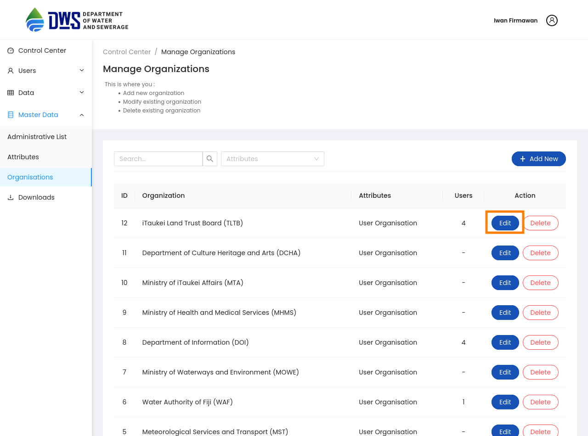

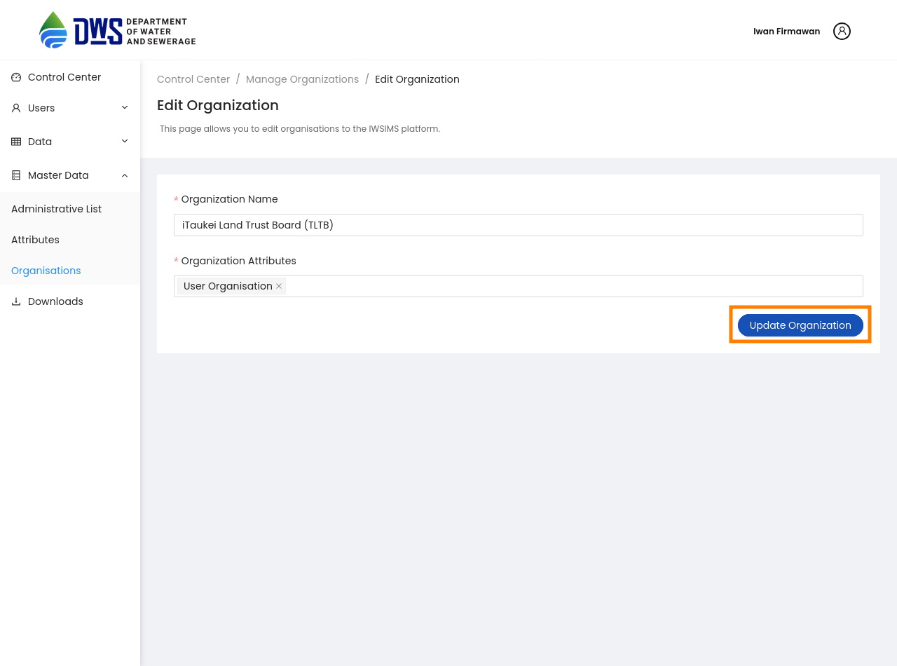

1. For deleting the organisation Click :bolditalic:`Delete` Button. Also make sure that no user is associated with the deleting organisation. Next, click on the confirmation popup window for deleting organisation.    

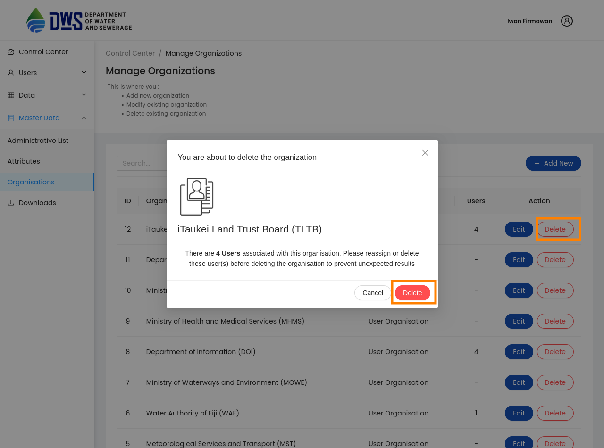
