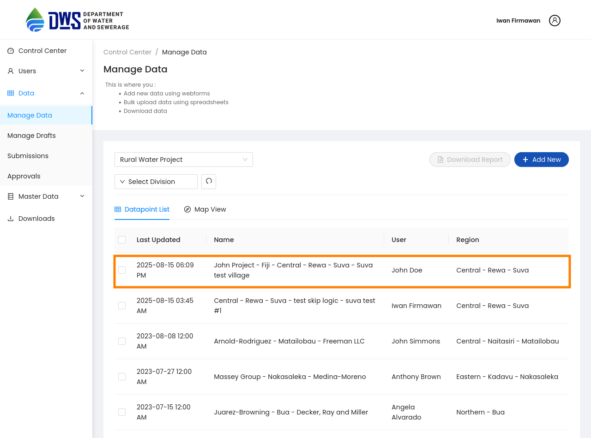
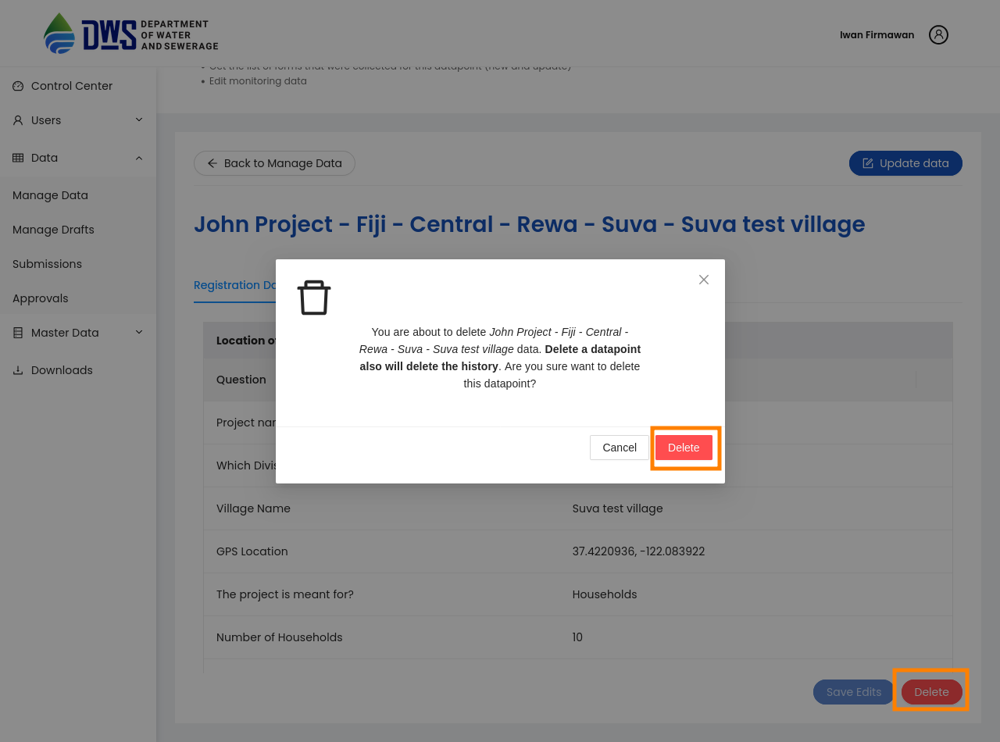

.. raw:: html

    

.. role:: heading

:heading:`Data Management`

.. role:: bolditalic

Deleting data
--------------

.. note::
   Data deletion can only be performed by Super-admin privileges, and this option is only accessible for Manage Data.

1. From the Data menu in the sidebar, click on the :bolditalic:`Manage Data` submenu. Then, select the row data you want to delete.

1. This will redirected to the Monitoring page, where you can see the selected data. Click the **Delete** button and confirm the deletion in the pop-up window.

.. Downloading data
.. -----------------

.. 1. Select the questionnaire and hover over the :bolditalic:`Download Data` button. You will have two options:
..     * **All data**: Get all data from the selected questionnaire.
..     * **Latest data**: Get only the latest data (new or updated) from the selected questionnaire.

.. .. image:: ../assests/manage-data-download-data.png
..     :alt: Download data
..     :width: 100%

.. 2. After selecting an option, you will be redirected to the Download page, where the following label information related to your action will be displayed.

.. .. image:: ../assests/download-page.png
..     :alt: Download data page
..     :width: 100%
