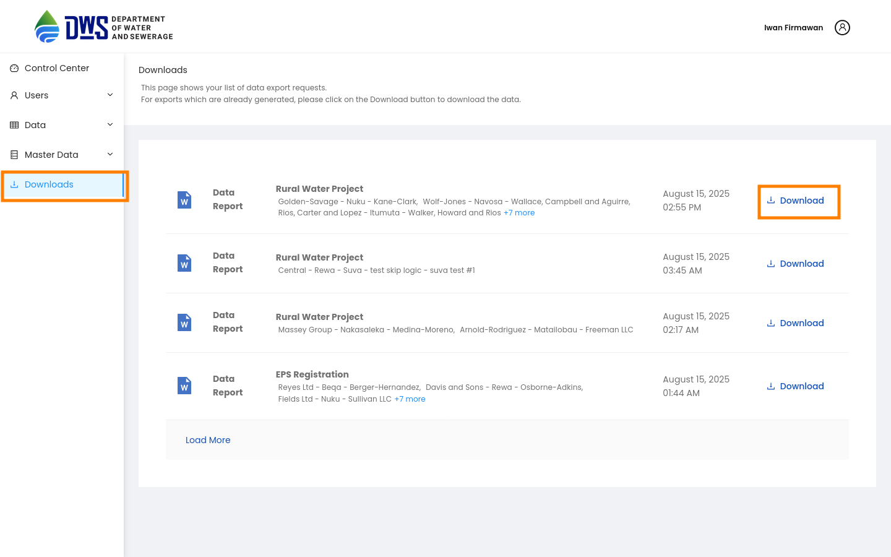
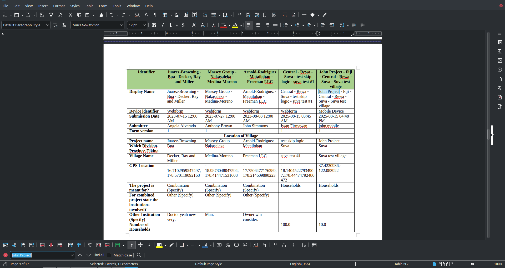
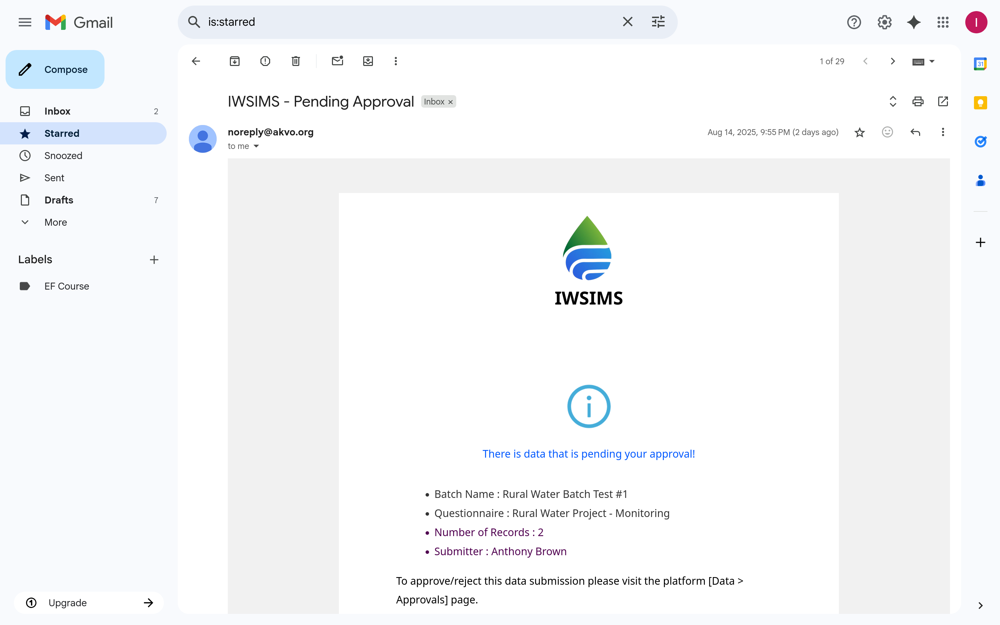

.. raw:: html

    

.. role:: heading

:heading:`Outputs`

Download Data Report (.docx)
------------------------------

Go to the Manage data menu, select the questionnaire you want to download data for, select row checkboxes for the data you want to download, and then check Monitoring questionnaires that you want to download data for.
Click the Download button to download the data as a document.

.. image:: ../assests/manage-data-download-report-1.png
    :alt: Select Data to Download
    :width: 100%

Downloaded data can be accessed from the Downloaded Data tab of the control center. Click the download button to get your data in a document format.

Here is the preview of the downloaded document:

Notifications
---------------

Users will get email notifications in the following scenarios:

* Invitation to set up an account for the first time
* Approver is notified there is pending data for approval
* Submitter is notified when data is approved
* Submitter is notified when data is rejected

