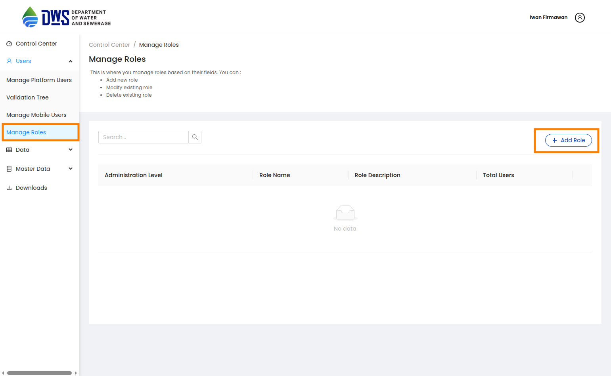
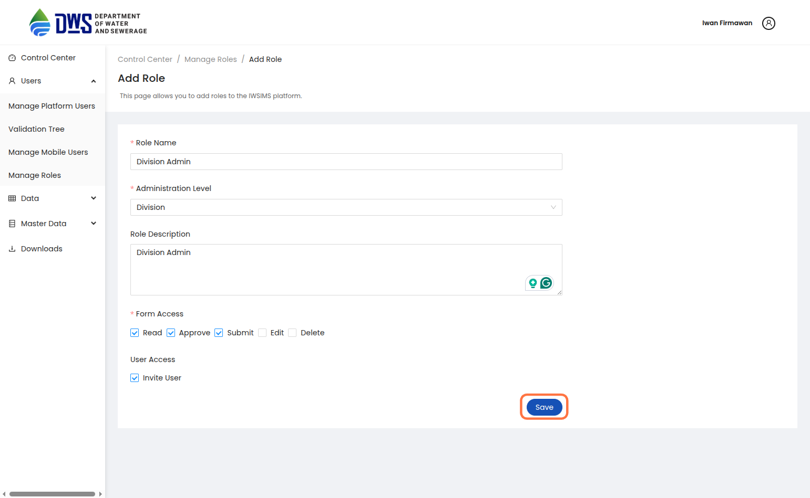
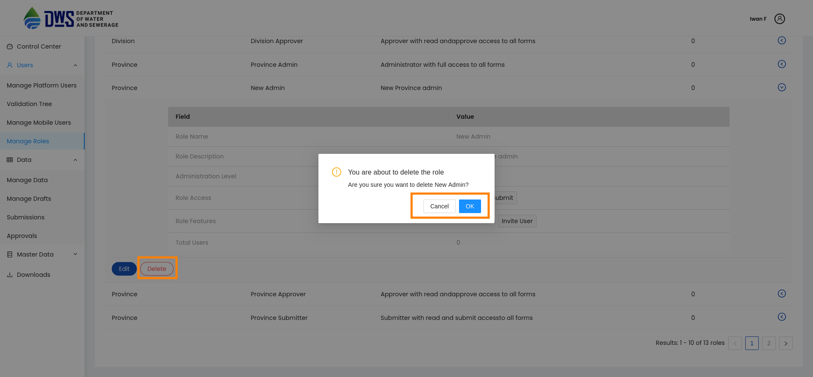
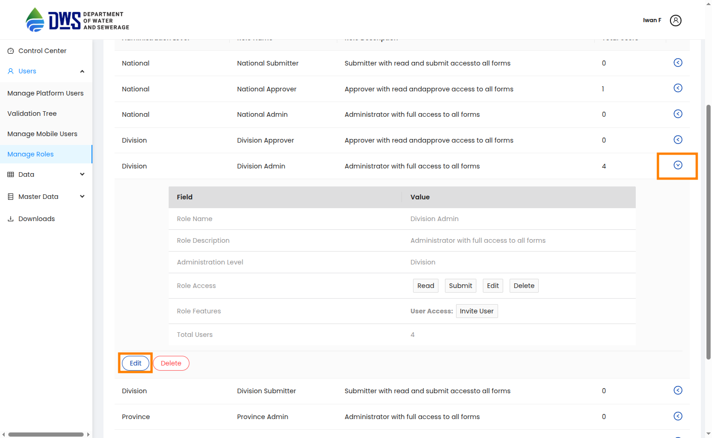
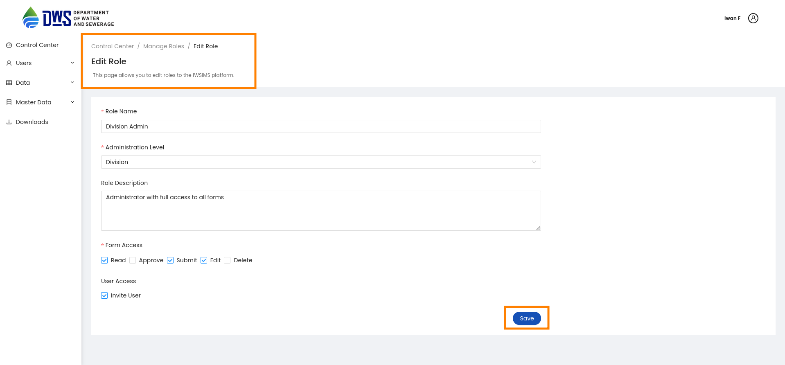
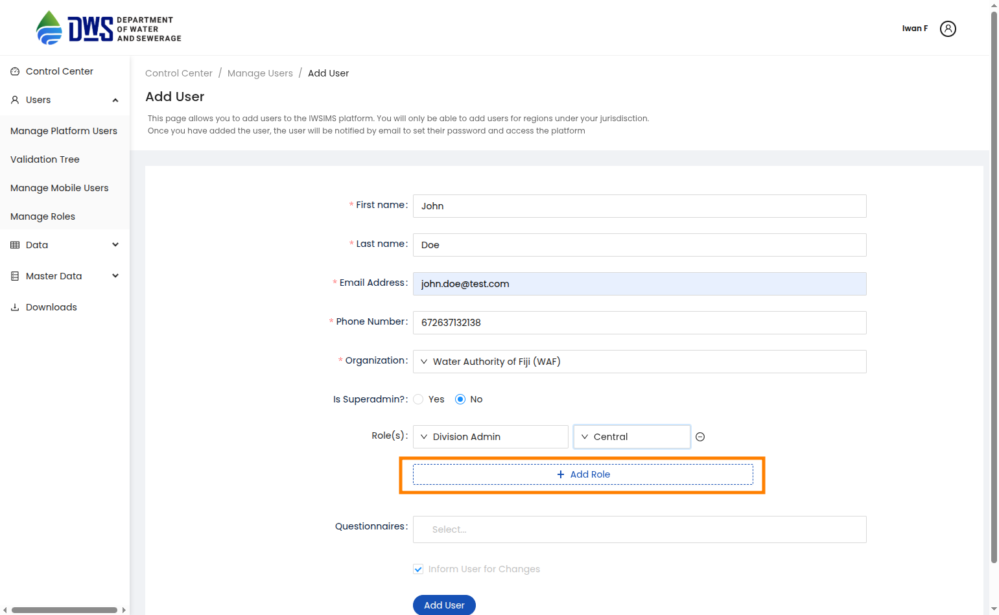
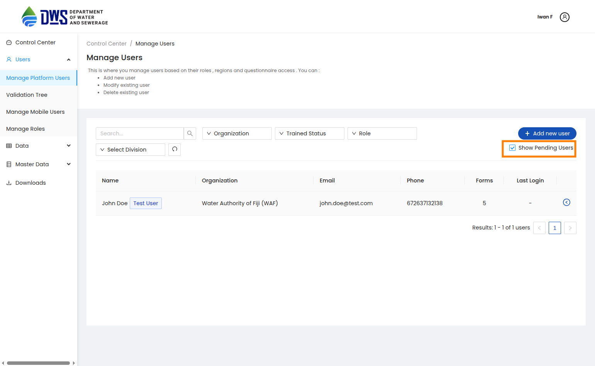
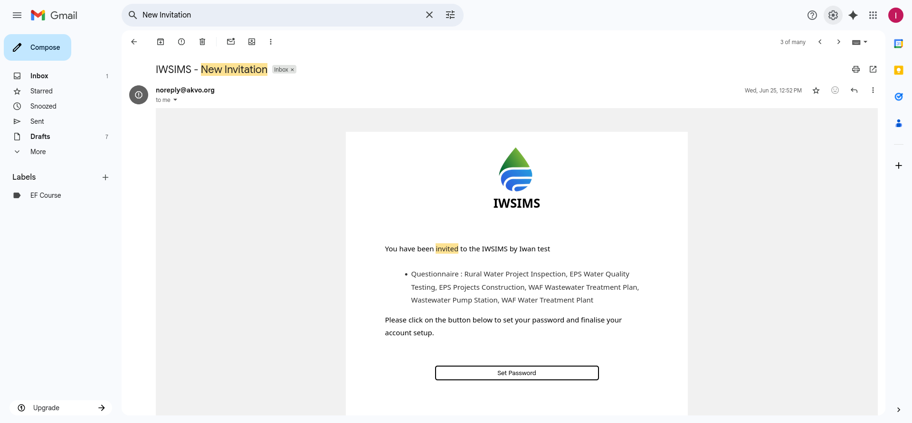
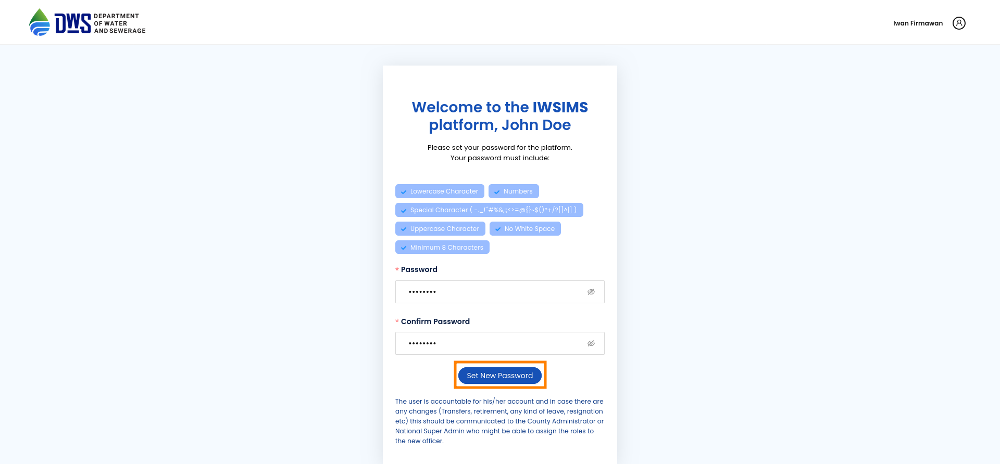

.. raw:: html

    

.. role:: heading

:heading:`Get Started`

User Types & Basic principal
-----------------------------

The Akvo MIS platform is designed to accommodate various user types, each with specific roles and permissions. The primary user types include:
- **Super Admin**: This user has full control over the system, including user management, role assignments, and system settings.
- **Admin**: Admins are created by the Super Admin and have the ability based on roles assigned to them.

Create an Super Admin Account via CLI
--------------------------------------

To create a Super Admin account, you need to run the following command in the terminal:

.. code-block:: bash

   python manage.py createsuperuser

Then fill in the required fields such as email, first name, last name, and password. After creating the Super Admin account, you can assign forms to the user using the following command:

.. code-block:: bash

   python manage.py assign_forms <email>

Roles and Permissions principal
--------------------------------

Roles in Akvo MIS define the permissions and access per administration level. Each role can be assigned to users, allowing them to perform specific actions within the system. The roles are designed to ensure that users have the necessary permissions to carry out their tasks while maintaining security and data integrity.

Form access
=============

Each role can have different permissions for form access, which include:

- **Read**: Users can view the data in the forms assigned to them.
- **Submit**: Users can submit data through the forms.
- **Approve**: Users can approve submitted data, allowing it to be finalized and processed.
- **Edit**: Users can edit existing data in the forms.
- **Delete**: Users can delete data from the forms.

User access
=============

User access in Akvo MIS is managed through roles and permissions. Each user can be assigned one or more roles, which determine their access level and the actions they can perform within the system. The user management interface allows administrators to add, modify, and delete users, as well as assign roles and permissions.

- **Invite Users**: Administrators can invite new users to join the system by sending them an invitation email. The invited user will need to set up their account by creating a password.

.. _manage_roles:

Manage Roles (Add, Delete and Modify Roles)
--------------------------------------------

1. From the Sidebar of the control center, click the  **Manage Roles** to add a new role, modify an existing role or delete an existing role.

1. To add a new role, click the **Add Role** button. Next, on the new page fill all the mandatory fields and then click the **Add Role** button
   to notify your new role.

1. To delete an existing role, expand the toggle button next to the role and click the **Delete** button. Next, confirm you are deleting the role by clicking the DELETE button in the pop-up window.

4. To modify an existing role, expand the toggle button next to the role and click the **Edit** button. Edit the role details in the new page and then click the **Update Role** button.

.. _manage_users:

Manage Users (Add, Delete and Modify Users)
------------------------------------------------

1. From the Sidebar of the control center, click the **Manage Platform Users** to add a new user, modify an existing user or delete an existing user.

.. image:: ../assests/users-list.png
   :alt: Manage User
   :width: 100%

2. To add a new user, click the **Add New User** button. Next, on the new page fill all the mandatory fields and assign the user an organisation, designation, role with related administrative region and questionnaires. Finally, click the **Add User** button to notify your new user.

.. image:: ../assests/users-add.png
   :alt: Add new User
   :width: 100%
  

.. image:: ../assests/users-add-save.png
   :alt: Add new User Save
   :width: 100%

3. A newer user will determine as pending user and will not be able to login until the user sets up their account by clicking the **Set Password** button in the invitation email.

.. image:: ../assests/users-pending-expand.png
   :alt: Pending User Expanded
   :width: 100%

4. To delete an existing user, expand the toggle button next to the user and click the **Delete** button. Next, confirm you are deleting the user by clicking the DELETE button in the pop-up window.

.. image:: ../assests/users-delete.png
   :alt: Delete User
   :width: 100%

5. To modify an existing user, expand the toggle button next to the user and click the **Edit** button. Edit the user details in the new page and then click the **Update User** button.

.. image:: ../assests/users-edit-expand.png
    :alt: Expand and Edit User
    :width: 100%

.. image:: ../assests/users-edit.png
   :alt: Edited User
   :width: 100%

Setting up Account for the First Time
---------------------------------------

Users who have been registered in the MIS platform will receive an invitation email to complete the account setup process. Click the Set Password button to activate your account.

Make sure you are on the testing url iwsims.akvo.org.Set a strong password and click Set New Password to login to your account.

